# Architecture

This document explains how the repository currently assembles, previews, validates, and publishes the active presentation.

The repo is now DOM-first for active authoring and PDF output. Slide-spec JSON under `presentations/<id>/slides/` is the content model, `studio/client/slide-dom.ts` is the shared renderer, and Playwright is the export and validation runtime around that renderer.

## Overview

There are now three layers:

1. `studio/state/presentations.json` selects the active presentation and `presentations/<id>/slides/*.json` holds its slide content model for supported slide families.
2. `studio/client/slide-dom.ts` renders those slide specs into a shared HTML/CSS slide runtime.
3. Playwright-backed server services turn that same runtime into PDFs, preview PNGs, and validation inputs.

Repo-level command wrappers live under `scripts/`, shared deck settings plus raster helpers live under `studio/server/services/`, and approved baseline snapshots live under `studio/baseline/<presentation-id>/`.

## System Graph

```mermaid
flowchart TD
    package["package.json scripts"] --> build["npm run build"]
    package --> validate["npm run validate"]
    package --> gate["npm run quality:gate"]
    package --> baseline["npm run baseline:render"]
    package --> studio["npm run studio:start"]

    subgraph content["Content Layer"]
        registry["studio/state/presentations.json"]
        slides["presentations/<id>/slides/slide-*.json"]
        state["presentations/<id>/state/*.json"]
    end

    subgraph dom["DOM Runtime"]
        slideDom["studio/client/slide-dom.ts"]
        preview["studio/server/services/dom-preview.ts"]
        export["studio/server/services/dom-export.ts"]
        validateDom["studio/server/services/dom-validate.ts"]
        buildSvc["studio/server/services/build.ts"]
        validateSvc["studio/server/services/validate.ts"]
        pageArtifacts["studio/server/services/page-artifacts.ts"]
    end

    subgraph scripts["CLI Scripts"]
        buildCli["scripts/build-deck.ts"]
        renderCli["scripts/validate-render.ts"]
        baselineCli["scripts/update-render-baseline.ts"]
        diagrams["scripts/render-diagrams.ts"]
        geometryCli["scripts/validate-geometry.ts"]
        textCli["scripts/validate-text.ts"]
    end

    subgraph shared["Studio Shared Services"]
        renderUtils["studio/server/services/baseline-utils.ts"]
        theme["studio/server/services/deck-theme.ts"]
        constraints["studio/server/services/design-constraints.ts"]
    end

    subgraph artifacts["Artifacts"]
        pdf["slides/output/<presentation-id>.pdf"]
        previews["studio/output/<presentation-id>/**"]
        baselineFiles["studio/baseline/<presentation-id>/*.png"]
        diffs["slides/output/render-diff/*.png"]
        archive["archive/<presentation-id>.pdf"]
    end

    slides --> slideDom
    registry --> slides
    state --> preview
    theme --> preview
    constraints --> validateDom
    preview --> export
    preview --> validateDom
    slideDom --> export
    slideDom --> validateDom
    export --> pdf
    export --> previews
    pageArtifacts --> previews

    studio --> buildSvc
    studio --> validateSvc
    buildSvc --> export
    validateSvc --> validateDom
    validateSvc --> renderUtils

    build --> diagrams
    build --> buildCli
    buildCli --> export

    validate --> diagrams
    validate --> geometryCli
    validate --> textCli
    geometryCli --> validateDom
    textCli --> validateDom

    gate --> renderCli
    renderCli --> renderUtils
    renderUtils --> pdf
    renderCli --> baselineFiles
    renderCli --> diffs

    baseline --> baselineCli
    baselineCli --> renderUtils
    baselineCli --> baselineFiles

    pdf -. manual archive refresh .-> archive
```

## Main Concepts

### Slide Spec Layer

Supported slides are authored as JSON documents in `presentations/<id>/slides/`. Each document contains the active slide spec for one presentation.

The supported families currently include:

- `cover`
- `toc`
- `content`
- `summary`

The studio reads and writes these specs directly. That is the primary authoring model now.

### Shared DOM Renderer

`studio/client/slide-dom.ts` is the shared rendering runtime. It is used in three places:

- browser preview surfaces inside the studio
- standalone `/deck-preview` rendering on the server
- Playwright-driven export and validation

This keeps preview and PDF output on the same layout path for active workflows.

### Playwright Runtime

`studio/server/services/dom-export.ts` renders the shared DOM runtime in headless Chromium to produce:

- the final deck PDF
- single-slide preview PNGs
- contact sheets and preview strips around those images

`studio/server/services/dom-validate.ts` uses the same browser runtime to inspect layout results for geometry and text checks.

### Scripts And Baseline Layer

The remaining non-server pieces are now narrower than before:

- repo-level `scripts/` files wrap build, diagram, geometry/text validation, render validation, and baseline refresh commands
- `studio/server/services/baseline-utils.ts` owns PDF rasterization and image comparison for the baseline gate
- `studio/server/services/deck-theme.ts` and `studio/server/services/design-constraints.ts` provide shared deterministic deck settings consumed by the DOM path

## Build Flow

The build path is now:

1. `npm run build` regenerates any Graphviz-authored diagrams through `scripts/render-diagrams.ts`.
2. `npm run build` then runs `scripts/build-deck.ts`.
3. That script collects the DOM preview state and calls the Playwright-backed export path.
4. The shared DOM renderer writes the final PDF to `slides/output/<presentation-id>.pdf`.

## Validation Flow

There are now two active validation layers.

### Geometry And Text Validation

`npm run validate` runs:

- `scripts/render-diagrams.ts`
- `scripts/validate-geometry.ts`
- `scripts/validate-text.ts`

The geometry and text entrypoints now call `studio/server/services/dom-validate.ts`, which evaluates the shared DOM slide runtime in Playwright and reports:

- bounds issues
- panel text padding issues
- minimum font-size issues
- maximum words-per-slide issues

This is the same validation path used by the studio server.

### Render Validation

`npm run validate:render` still checks the final PDF visually against the approved raster baseline:

1. build the current PDF through the DOM export path
2. rasterize the PDF pages with ImageMagick through `studio/server/services/baseline-utils.ts`
3. compare the rasterized pages to `studio/baseline/<presentation-id>/*.png`
4. write diffs under `slides/output/render-diff/` when pages drift

`npm run quality:gate` runs the DOM geometry/text validators first and then this render-baseline gate.

## Studio Runtime

The local studio under `studio/` is now a control plane around the shared DOM renderer:

- `studio/server/services/build.ts` rebuilds the PDF and preview images
- `studio/server/services/validate.ts` runs DOM validation and, optionally, the render-baseline gate
- `studio/server/services/operations.ts` manages variant generation, deck plans, apply flows, and transient preview artifacts
- `studio/server/services/page-artifacts.ts` now owns generic page-listing and contact-sheet work for studio-side preview flows, instead of reaching into generator helpers for that concern
- `studio/server/services/baseline-utils.ts` now owns the raster-baseline helper layer used by both the studio validator and the CLI render gate

## Baseline And Archive

The repo still keeps two long-lived output types:

- `studio/baseline/<presentation-id>/` is the approved visual regression target for each presentation
- `archive/<presentation-id>.pdf` is the checked-in presentation snapshot for linking and archival when a deck is published

They serve different roles. Refreshing the render baseline is part of intentional visual changes. Refreshing the archive is a separate publishing decision.

## Extension Points

If you are extending the current system, the normal entry points are now:

- add or refine supported slide rendering in `studio/client/slide-dom.ts`
- add or refine server-side export behavior in `studio/server/services/dom-export.ts`
- deepen DOM validation in `studio/server/services/dom-validate.ts`
- update deck-level metadata and theme resolution in `studio/server/services/state.ts` and `studio/server/services/deck-theme.ts`
- change raster-baseline comparison behavior in `studio/server/services/baseline-utils.ts` and `scripts/validate-render.ts`

## Migration Direction

The remaining cleanup direction is:

- deepen DOM validation where the older generator checks still covered useful layout-specific signals
- keep the baseline-comparison utilities narrow instead of growing another generic preview-helper layer under `studio/server/services/`
- keep architecture docs aligned so the DOM runtime is described as the primary system, not as a preview sidecar
