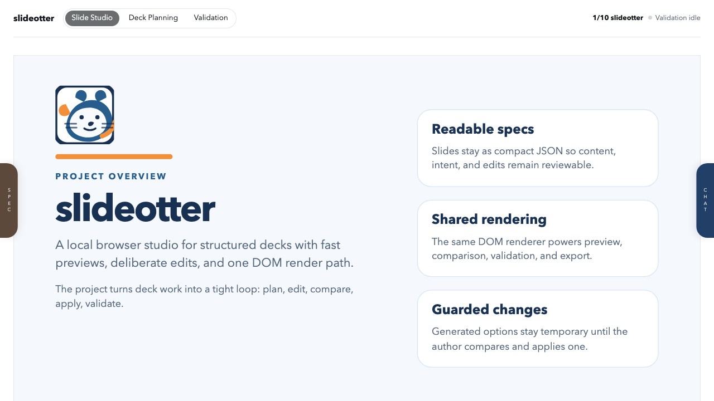

# slideotter

> NOTE! This software is under heavy development right now, and I consider it alpha level so if you try it, expect to find bugs, underspecified features, and weird UI/UX solutions. I found that it works well with LM Studio (Qwen, Gemma) and most likely the other LLM connectors work as well. Likely foundation models work far better/faster, but the application has been designed with weak local models in mind.


slideotter is a local workbench for building structured presentations that stay editable, grounded, and reviewable.

It is built around a simple loop: describe the deck, add sources and materials, preview the result in the browser, compare alternatives, apply the useful changes, and publish a checked PDF when the result is ready.

It is not trying to replace PowerPoint or become a general WYSIWYG editor. The focus is controlled generation and structured deck work where the source, review path, and final archive remain inspectable.

## Start Here

Use the getting-started guide for installation, required tools, and the first local run:

[Getting Started](docs/GETTING_STARTED.md)

The short version:

```bash
npm install
npm run studio:start
```

Then open `http://127.0.0.1:4173`.

## What You Can Do

- Work on multiple local presentations with visual first-slide cards.
- Create a deck from a brief, target length, visual direction, starter sources, and optional starter images.
- Scale a presentation semantically: shrink by skipping slides, grow by restoring skipped slides or adding detail slides.
- Edit supported slides as readable JSON specs.
- Preview the active deck while you work.
- Attach image materials to slides, provide a starter image, or import sourced open-license images through Openverse or Wikimedia Commons.
- Ground generation with presentation-scoped notes, excerpts, URLs, and image material metadata.
- Generate first drafts with OpenAI, LM Studio, or OpenRouter, then review candidates before applying changes.
- Compare candidate slides and deck plans before applying them.
- Validate layout, text, media references, workflow behavior, and rendered output.
- Build a PDF and refresh an archive copy when you are ready to publish.

## Studio

The browser studio is the main working surface.



It includes presentation selection, slide preview, thumbnail navigation, source and material workflows, candidate review, semantic length scaling, deck planning, validation settings, provider status, and light/dark mode.

## Included Demo

The repository includes a twenty-slide `slideotter` presentation that explains the tool and its workflow. Its source lives under `presentations/slideotter/`, and the generated PDF is written locally to `slides/output/slideotter.pdf`.

Checked-in archive snapshots live under `archive/`.

## Documentation

- [Getting Started](docs/GETTING_STARTED.md): required tools, setup, first run, and common commands
- [DEVELOPMENT.md](DEVELOPMENT.md): development workflow, validation, LLM setup, and slide workflow notes
- [Architecture](docs/ARCHITECTURE.md): rendering, generation, validation, and artifact architecture
- [TECHNICAL.md](TECHNICAL.md): lower-level project layout notes
- [ROADMAP.md](ROADMAP.md): current product and architecture direction
- [STUDIO_STATUS.md](STUDIO_STATUS.md): live implementation snapshot
