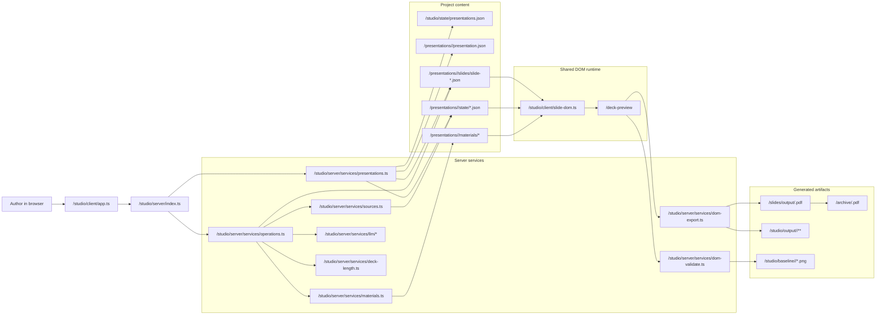
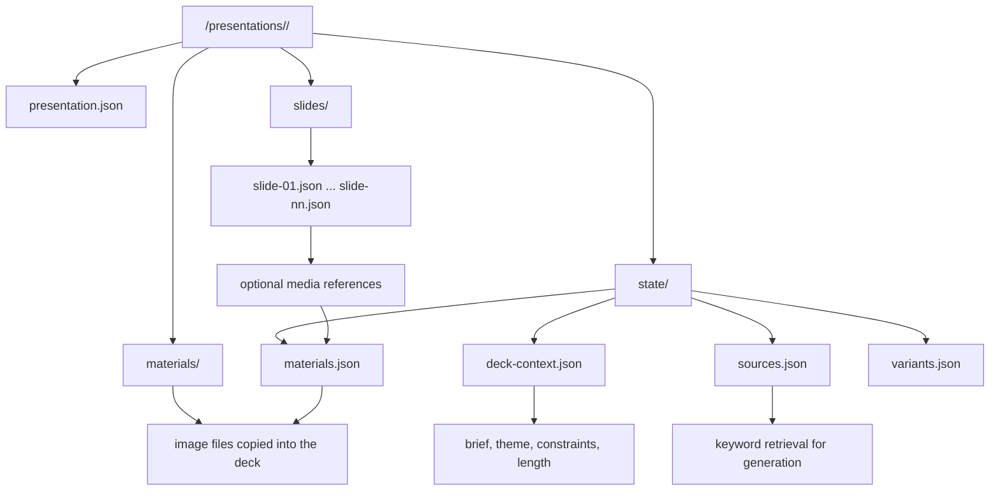
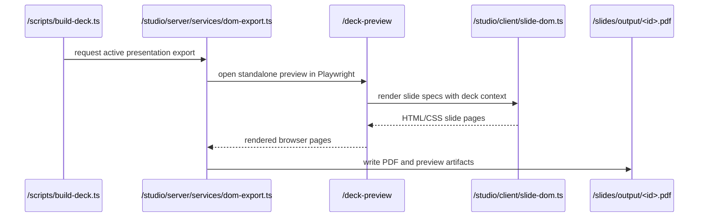
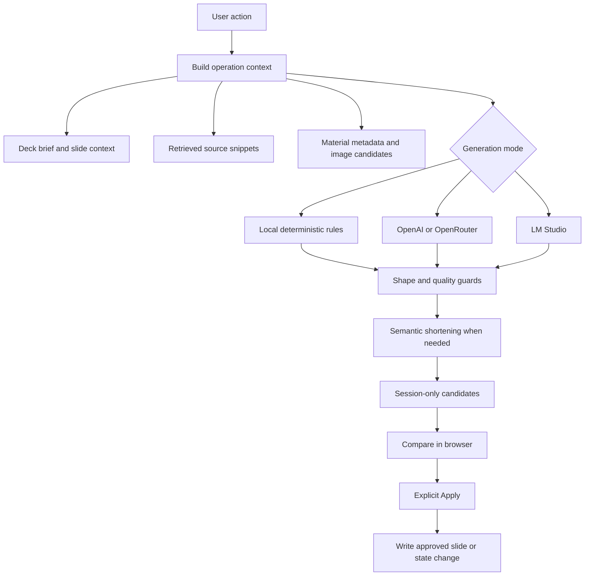
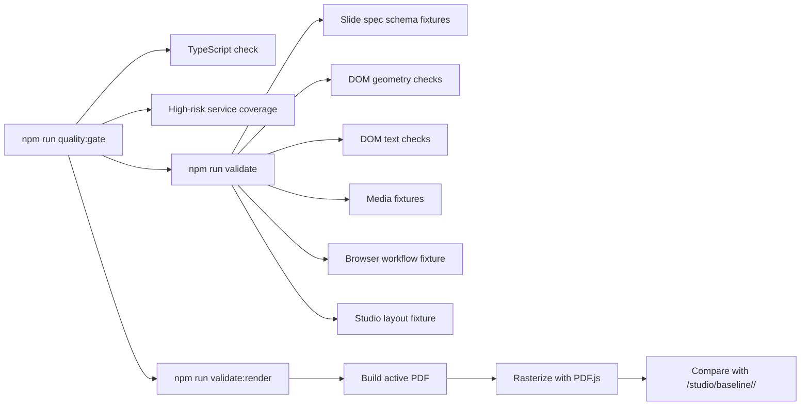

# Architecture

This document describes the current slideotter architecture. Paths use project-root absolute form, such as `/studio/server/index.ts`; they are not machine filesystem paths.

slideotter is a local workbench for structured presentations that stay editable, grounded, and reviewable. The active deck lives in `/presentations/<id>/`, the browser and server coordinate guarded edits, and the shared DOM renderer is the implementation path for preview, PDF export, and layout validation.

## System Map

## Core Responsibilities

`/studio/client/` is the browser control surface. It renders navigation, presentation selection, slide preview, slide context, variant generation, deck planning, checks, and the scoped assistant panel. It does not write files directly.

`/studio/server/` is the write boundary. It validates requests, resolves the active presentation, loads sources and materials, calls local or LLM generation, materializes accepted changes, exports PDFs, and runs validation.

`/presentations/<id>/` is the deck workspace. It contains the slide specs, presentation metadata, deck context, sources, materials, generation state, and other presentation-local state.

`/scripts/` contains repo command wrappers for build, validation, archive refresh, screenshot capture, baselines, and fixtures. These wrappers call the same server-side services the studio uses.

## Presentation Storage

The registry at `/studio/state/presentations.json` stores the active presentation id and the list of known local presentations. Selecting, duplicating, deleting, and creating presentations all go through `/studio/server/services/presentations.ts`.

Slides are JSON specs for supported families: `cover`, `toc`, `content`, and `summary`. A slide can be active, skipped for reversible length scaling, or archived by manual removal.

## Rendering And Export

The DOM renderer in `/studio/client/slide-dom.ts` is authoritative. Browser preview, compare views, thumbnails, `/deck-preview`, PDF export, and DOM validation all use that same slide runtime.

## Generation Flow

Generation is proposal-oriented. Slide variants, deck plans, regenerated presentations, theme changes, and semantic length scaling produce inspectable candidates first. The server writes only after an explicit apply or create action.

LLM providers are configured through environment variables and OpenAI-compatible APIs:

- OpenAI: `STUDIO_LLM_PROVIDER=openai`
- LM Studio: `STUDIO_LLM_PROVIDER=lmstudio`
- OpenRouter: `STUDIO_LLM_PROVIDER=openrouter`

The navigation status and diagnostics expose provider availability, request progress, retrieved snippets, and recent workflow events without making those details the primary UI.

## Source And Material Grounding

Text sources live in `/presentations/<id>/state/sources.json`. Generation builds a lightweight query from deck and slide context, retrieves matching chunks, and injects bounded snippets into local or LLM generation.

Image materials live in `/presentations/<id>/materials/` with metadata in `/presentations/<id>/state/materials.json`. New presentation setup can accept a starter image or import open-license images from explicit Openverse or Wikimedia searches. Stored metadata preserves provider, creator, license, license URL, and source URL when available.

Material-aware generation can attach a matching saved image to a structured slide. The slide spec references the material through a validated media object, and the DOM renderer keeps image, caption, and source line together.

## Validation And Quality Gate

Validation is layered:

- type checks cover the TypeScript sources
- service tests cover high-risk server behavior
- DOM validators catch layout, text, contrast, bounds, and media issues
- workflow fixtures exercise browser flows
- render validation compares the current PDF to `/studio/baseline/<id>/`

Intentional visual changes should refresh `/studio/baseline/<id>/` with `npm run baseline:render`.

## Artifact Lifecycle

`npm run build` writes `/slides/output/<id>.pdf` for the active presentation.

`npm run archive:update` copies that current PDF to `/archive/<id>.pdf` as a checked-in publishing snapshot.

`npm run screenshot:home` captures `/docs/assets/studio-home.png` for the README.

`npm run baseline:render` refreshes `/studio/baseline/<id>/` for intentional visual changes.

## Extension Points

Common change points:

- add slide rendering behavior in `/studio/client/slide-dom.ts`
- add guarded server actions in `/studio/server/services/operations.ts`
- adjust presentation lifecycle behavior in `/studio/server/services/presentations.ts`
- extend grounding in `/studio/server/services/sources.ts` or `/studio/server/services/materials.ts`
- refine semantic length scaling in `/studio/server/services/deck-length.ts`
- deepen validation in `/studio/server/services/dom-validate.ts`
- update command wrappers under `/scripts/`

Keep new writes inside the existing allowlist: `/presentations/<id>/`, `/studio/state/`, `/studio/output/`, `/slides/output/`, `/studio/baseline/`, and `/archive/`.
