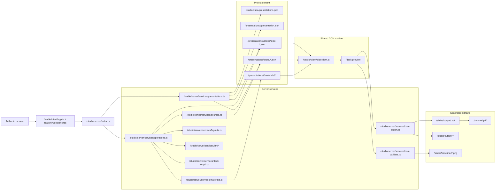
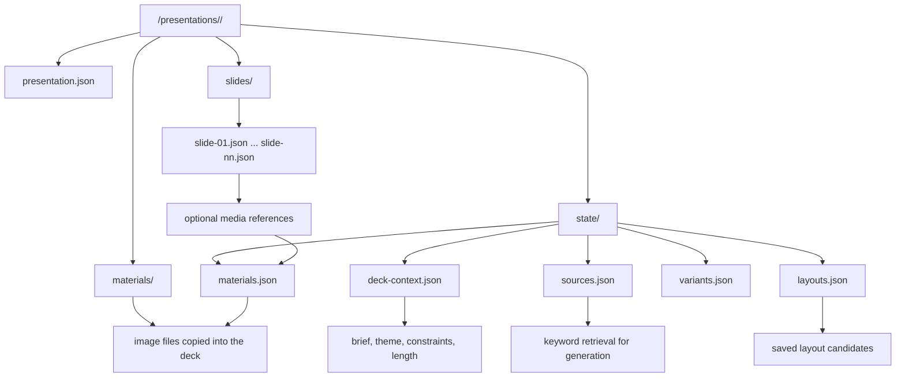
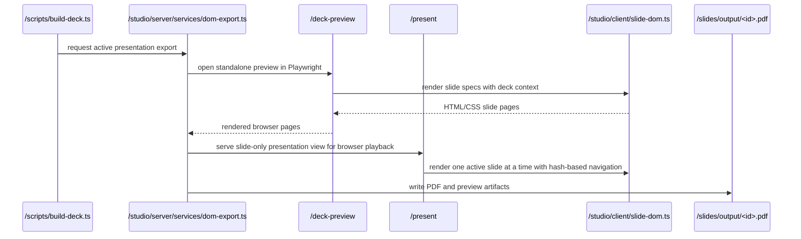
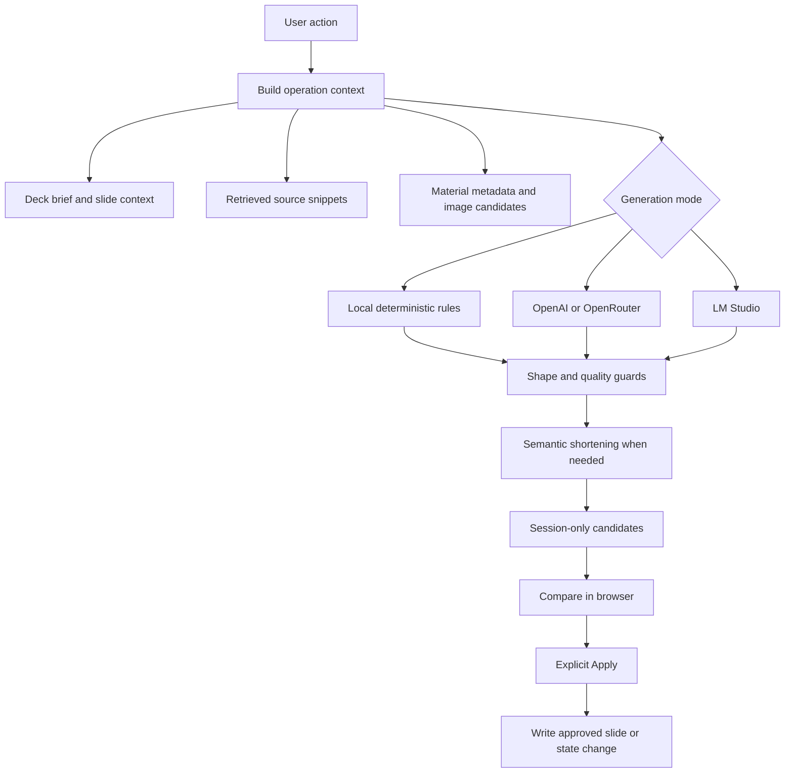
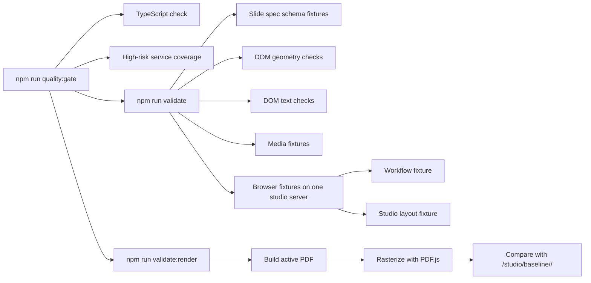

# Architecture

This document describes the current slideotter architecture. Paths use project-root absolute form, such as `/studio/server/index.ts`; they are not machine filesystem paths.

slideotter is a local workbench for structured presentations that stay editable, grounded, and reviewable. The active deck lives in `/presentations/<id>/`, the browser and server coordinate guarded edits, and the shared DOM renderer is the implementation path for preview, PDF export, and layout validation.

## System Map

## Core Responsibilities

`/studio/client/` is the browser control surface. `app.ts` composes shared state, page routing, refresh, and cross-workbench orchestration while feature scripts own focused surfaces such as presentation creation, custom layouts, theme review, variant review, current-slide editing, and deck planning. The client renders navigation, presentation selection, slide preview, slide context, variant generation, deck planning, checks, and the scoped assistant panel. It does not write files directly.

`/studio/server/` is the write boundary. It validates requests, resolves the active presentation, loads sources, materials, and reusable layouts, calls local or LLM generation, materializes accepted changes, exports PDFs, and runs validation.

`/presentations/<id>/` is the repo-mode deck workspace. In app mode the same deck shape lives under `~/.slideotter/presentations/<id>/`. It contains the slide specs, presentation metadata, deck context, sources, materials, generation state, and other presentation-local state.

`/bin/slideotter.mjs` is the app command. It initializes user data, starts the studio, builds PDFs, validates decks, and archives output against the active user data root.

`/desktop/main.cjs` is the macOS Electron wrapper. It starts the packaged studio server on loopback, opens the existing studio client in an isolated desktop window, honors the same user-data environment variables as the CLI, and keeps file writes behind the server boundary.

`/scripts/` contains repo command wrappers for build, validation, archive refresh, screenshot capture, baselines, package generation, and fixtures. These wrappers call the same server-side services the studio uses.

## Code Navigation

Use this section first when looking for where to make a change.

### Browser Client

The browser client is built with Vite from `/studio/client/main.ts`, which imports `/studio/client/app.ts`. The served production assets are generated under `/studio/client-dist/` and are not the editing source.

`/studio/client/app.ts` is the composition shell. It should stay focused on:

- creating shared `state` and `elements`
- composing workbenches
- refreshing `/api/state` and loading the selected slide
- saving deck context, validation settings, and deck theme state
- calling build and validation endpoints
- wiring only cross-feature commands that do not have a clearer owning workbench

Feature ownership:

| Area | Primary file |
| --- | --- |
| App bootstrap | `/studio/client/main.ts` |
| Composition, refresh, selected slide load | `/studio/client/app.ts` |
| Shared state shape and abortable request helpers | `/studio/client/state.ts` |
| DOM element registry | `/studio/client/elements.ts` |
| Fetch helpers, escaping, JSON highlighting, DOM helper | `/studio/client/core.ts` |
| Local preferences | `/studio/client/preferences.ts` |
| Page routing and drawer shell | `/studio/client/navigation-shell.ts` |
| Drawer state mechanics | `/studio/client/drawers.ts` |
| Active preview and thumbnail rail orchestration | `/studio/client/preview-workbench.ts` |
| DOM slide preview wrapper | `/studio/client/slide-preview.ts` |
| Shared DOM slide renderer and presentation document runtime | `/studio/client/slide-dom.ts` |
| Presentation list, select, duplicate, delete, regenerate | `/studio/client/presentation-library.ts` |
| Staged presentation creation and live content run UI | `/studio/client/presentation-creation-workbench.ts` |
| Theme drawer, candidates, saved themes | `/studio/client/theme-workbench.ts` |
| Custom layout editor, Layout Studio, layout library UI | `/studio/client/custom-layout-workbench.ts` |
| Variant generation, candidate rail, compare/apply | `/studio/client/variant-review-workbench.ts` |
| Current-slide editing, inline text editing, materials, manual slides | `/studio/client/slide-editor-workbench.ts` |
| Deck length, deck structure candidates, sources, outline plans | `/studio/client/deck-planning-workbench.ts` |
| Runtime diagnostics, workflow history, LLM status stream | `/studio/client/runtime-status-workbench.ts` |
| LLM status formatting | `/studio/client/llm-status.ts` |
| Assistant drawer rendering and message application | `/studio/client/assistant-workbench.ts` |
| API Explorer | `/studio/client/api-explorer.ts` |
| Validation report rendering | `/studio/client/validation-report.ts` |
| Slide and deck workflow runners | `/studio/client/workflows.ts` |
| App light/dark chrome theme | `/studio/client/app-theme.ts` |
| Client CSS | `/studio/client/styles.css` |

Current client maintenance direction:

- ADR 0044 tracks the repo-wide strict TypeScript migration.
- ADR 0045 tracks the browser-client contract cleanup: typed state/elements, typed workbench dependencies, typed API payloads, moving command mounting to owning modules, and reducing repeated dynamic `innerHTML`.
- When changing TypeScript contracts, keep `npm run validate:type-safety` passing without explicit `any` nodes or strict compiler diagnostics.

### Server And Services

`/studio/server/index.ts` owns HTTP routing, request parsing, response composition, runtime event streams, and coarse endpoint wiring. Domain logic should live in `/studio/server/services/` rather than growing route handlers.

| Area | Primary file |
| --- | --- |
| HTTP server, routes, runtime stream | `/studio/server/index.ts` |
| Presentation registry, lifecycle, outline plans | `/studio/server/services/presentations.ts` |
| Slide file listing, reading, writing, skip/restore | `/studio/server/services/slides.ts` |
| Structured slide schema and normalization | `/studio/server/services/slide-specs/` |
| Slide workflows, candidates, apply operations | `/studio/server/services/operations.ts` |
| Reusable layout definitions and layout import/export | `/studio/server/services/layouts.ts` |
| Theme normalization and generation | `/studio/server/services/deck-theme.ts`, `/studio/server/services/theme-generation.ts`, `/studio/server/services/theme-candidates.ts` |
| Reversible and semantic deck length planning | `/studio/server/services/deck-length.ts` |
| Presentation generation and staged materialization | `/studio/server/services/presentation-generation.ts` |
| LLM provider configuration, prompts, schemas | `/studio/server/services/llm/` |
| Sources and retrieval | `/studio/server/services/sources.ts` |
| Materials and image imports | `/studio/server/services/materials.ts`, `/studio/server/services/image-search.ts` |
| Variant storage | `/studio/server/services/variants.ts` |
| Selection-scoped apply guards | `/studio/server/services/selection-scope.ts` |
| Hypermedia `/api/v1` resources | `/studio/server/services/hypermedia.ts` |
| DOM preview state | `/studio/server/services/dom-preview.ts` |
| PDF/PNG export through Playwright | `/studio/server/services/dom-export.ts` |
| DOM layout, text, media validation | `/studio/server/services/dom-validate.ts`, `/studio/server/services/validate.ts` |
| Runtime config and user data paths | `/studio/server/services/runtime-config.ts` |
| Write allowlist boundary | `/studio/server/services/write-boundary.ts` |
| Generation diagnostics | `/studio/server/services/generation-diagnostics.ts` |

### Docs, Tests, And Fixtures

| Need | Primary location |
| --- | --- |
| Architecture and code navigation | `/docs/ARCHITECTURE.md` |
| Active roadmap and next slices | `/ROADMAP.md` |
| Live studio implementation snapshot | `/STUDIO_STATUS.md` |
| Durable decisions | `/docs/adr/` |
| Browser workflow fixture | `/scripts/validate-presentation-workflow.ts` |
| Browser layout fixture | `/scripts/validate-studio-layout.ts` |
| Client fixture/dead-code checks | `/scripts/validate-client-fixture.ts`, `/scripts/validate-dead-code.ts` |
| Explicit `any` guard | `/scripts/check-explicit-any.ts` |
| High-risk service tests | `/tests/high-risk-services.test.ts` |
| Hypermedia tests | `/tests/hypermedia-api.test.ts` |
| Layout definition tests | `/tests/layout-definitions.test.ts` |

## Presentation Storage

The registry at `/studio/state/presentations.json` stores the active presentation id and the list of known local presentations in repo mode. In app mode, the registry lives under `~/.slideotter/state/presentations.json`. Selecting, duplicating, deleting, and creating presentations all go through `/studio/server/services/presentations.ts`.

Slides are JSON specs for supported families: `cover`, `divider`, `quote`, `photo`, `photoGrid`, `toc`, `content`, and `summary`. A slide can be active, skipped for reversible length scaling, or archived by manual removal.

Reusable layout definitions live in `/presentations/<id>/state/layouts.json` for deck-local layouts and in the user-level layout library for favorites. The layout service accepts constrained JSON definitions such as `slotRegionLayout` and `photoGridArrangement`; Redo Layout and Custom Layout candidates can carry those definitions through preview, compare, save, favorite, export, import, and revalidation without executing arbitrary HTML, CSS, SVG, or JavaScript. The first custom layout editor is content-slide scoped and sends validated layout JSON to the server before a session-only preview candidate can be saved or applied.

## Rendering And Export

The DOM renderer in `/studio/client/slide-dom.ts` is authoritative. Browser preview, compare views, thumbnails, `/deck-preview`, `/present`, PDF export, and DOM validation all use that same slide runtime.

## Generation Flow

Generation is proposal-oriented. Slide variants, deck plans, regenerated presentations, theme changes, and semantic length scaling produce inspectable candidates first. The server writes only after an explicit apply or create action.

LLM providers are configured through environment variables and OpenAI-compatible APIs:

- OpenAI: `STUDIO_LLM_PROVIDER=openai`
- LM Studio: `STUDIO_LLM_PROVIDER=lmstudio`
- OpenRouter: `STUDIO_LLM_PROVIDER=openrouter`

When LM Studio is active, the LLM status popover can refresh currently loaded models from `/models` and store a runtime model override in ignored runtime state. OpenAI and OpenRouter model selection remain environment/config driven.

The navigation status and diagnostics expose provider availability, request progress, retrieved snippets, and recent workflow events without making those details the primary UI.

## Source And Material Grounding

Text sources live in `/presentations/<id>/state/sources.json`. Generation builds a lightweight query from deck and slide context, retrieves matching chunks, and injects bounded snippets into local or LLM generation.

Image materials live in `/presentations/<id>/materials/` with metadata in `/presentations/<id>/state/materials.json`. New presentation setup can accept a starter image or import open-license images from explicit Openverse or Wikimedia searches. Stored metadata preserves provider, creator, license, license URL, and source URL when available.

Material-aware generation can attach a matching saved image to a structured slide. The slide spec references the material through a validated media object, and the DOM renderer keeps image, caption, and source line together.

## Validation And Quality Gate

Validation is layered:

- type checks cover the TypeScript sources
- service tests cover high-risk server behavior
- DOM validators catch layout, text, contrast, bounds, and media issues
- browser fixtures exercise workflow and layout behavior through one shared studio server
- render validation compares the current PDF to `/studio/baseline/<id>/`

Intentional visual changes should refresh `/studio/baseline/<id>/` with `npm run baseline:render`.

## Artifact Lifecycle

`slideotter build` writes `~/.slideotter/output/<id>.pdf` for the active app presentation. `npm run build` writes `/slides/output/<id>.pdf` for repo development.

`slideotter archive` copies the current app PDF to `~/.slideotter/archive/<id>.pdf`. `npm run archive:update` copies the repo-mode PDF to `/archive/<id>.pdf` as a checked-in publishing snapshot.

`npm run screenshot:home` captures `/docs/assets/studio-home.png` for the README.

`npm run baseline:render` refreshes `/studio/baseline/<id>/` for intentional visual changes.

## Extension Points

Common change points:

- add slide rendering behavior in `/studio/client/slide-dom.ts`
- adjust browser shell composition in `/studio/client/app.ts`
- update a browser feature in its owning `/studio/client/*-workbench.ts` file
- add guarded server actions in `/studio/server/services/operations.ts`
- extend reusable layout definitions in `/studio/server/services/layouts.ts`
- adjust presentation lifecycle behavior in `/studio/server/services/presentations.ts`
- extend grounding in `/studio/server/services/sources.ts` or `/studio/server/services/materials.ts`
- refine semantic length scaling in `/studio/server/services/deck-length.ts`
- deepen validation in `/studio/server/services/dom-validate.ts`
- update command wrappers under `/scripts/`
- update ADR, roadmap, and status links when a durable architecture decision changes

Keep app-mode writes inside the user data root allowlist: `~/.slideotter/presentations/<id>/`, `~/.slideotter/state/`, `~/.slideotter/output/`, `~/.slideotter/baseline/`, `~/.slideotter/libraries/`, and `~/.slideotter/archive/`. Repo-mode writes remain limited to `/presentations/<id>/`, `/studio/state/`, `/studio/output/`, `/slides/output/`, `/studio/baseline/`, and `/archive/`.
